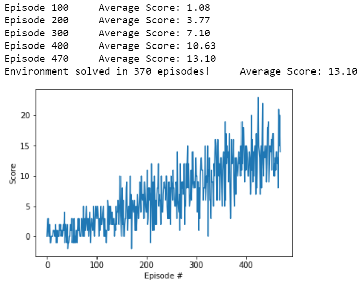

# Navigation-Project-with-DQN
Implementation of the Deep Q-Network (DQN) algorithm to solve a Navigation environment. The algorithm for the DQN agent was introduced in this [paper](https://storage.googleapis.com/deepmind-media/dqn/DQNNaturePaper.pdf).


### About the environment:

For this project, I trained an agent to learn navigation in a Unity-ML type environment.
Specifically, the trained agent will navigate (and collect bananas!) in a large, square world to maximize its rewards.

A reward of +1 is provided for collecting a yellow banana, and a reward of -1 is provided for collecting a blue banana. 

The state space has 37 dimensions and contains the agent's velocity, along with ray-based perception of objects around agent's forward direction. Given this information, the agent has to learn how to best select actions. Four discrete actions are available, corresponding to:

- **`0`** - move forward.
- **`1`** - move backward.
- **`2`** - turn left.
- **`3`** - turn right.

The task is episodic, and in order to solve the environment, the agent must get an average score of +13 over 100 consecutive episodes.

### Getting Started:

1. Download the environment from one of the links below.  You need only select the environment that matches your operating system:
    - Linux: [click here](https://s3-us-west-1.amazonaws.com/udacity-drlnd/P1/Banana/Banana_Linux.zip)
    - Mac OSX: [click here](https://s3-us-west-1.amazonaws.com/udacity-drlnd/P1/Banana/Banana.app.zip)
    - Windows (32-bit): [click here](https://s3-us-west-1.amazonaws.com/udacity-drlnd/P1/Banana/Banana_Windows_x86.zip)
    - Windows (64-bit): [click here](https://s3-us-west-1.amazonaws.com/udacity-drlnd/P1/Banana/Banana_Windows_x86_64.zip)
    
(_For Windows users_) Check out [this link](https://support.microsoft.com/en-us/help/827218/how-to-determine-whether-a-computer-is-running-a-32-bit-version-or-64) if you need help with determining if your computer is running a 32-bit version or 64-bit version of the Windows operating system.

(_For AWS_) If you'd like to train the agent on AWS (and have not [enabled a virtual screen](https://github.com/Unity-Technologies/ml-agents/blob/master/docs/Training-on-Amazon-Web-Service.md)), then please use [this link](https://s3-us-west-1.amazonaws.com/udacity-drlnd/P1/Banana/Banana_Linux_NoVis.zip) to obtain the environment.

### Instructions:

Please run ``` python run.py ``` to evaluate my trained weights.

run ``` python train.py ``` to train your own weights.

Run the cell in Navigation_Project_Sub.ipynb as per the sequence. I have included the code for creating an instance of the Agent, Replay_Buffer as well as the Q-Network in the notebook itself and separate modules for each. All the hyperparameters are initialized in these cells itself but you are welcome to change them as you wish. 

I have provided explanation in the cells for almost every line of code to make it easy for new learners to understand the process of the project.

I have also provided my trained model - Banana_saved_model.pth which gives an averag score of 13.10 in just 500 episodes. 

The plot of Episode vs Scores is as follows:



### Ideas for future work:

For this project, my agent learned from information such as its velocity, along with ray-based perception of objects around its forward direction. A more challenging task would be to learn directly from pixels!

This environment is almost identical to the project environment, where the only difference is that the state is an 84 x 84 RGB image, corresponding to the agent's first-person view of the environment.

Instead of using a Sequential Network, we will need to use Convolutional network to extract information from the States.

More ideas on training an agent for pixel states can be taken from this research paper - https://storage.googleapis.com/deepmind-media/dqn/DQNNaturePaper.pdf

### Note:
If the jupyter notebook does not display for some reason, please copy the link to the notebook and use this website - https://nbviewer.jupyter.org/

